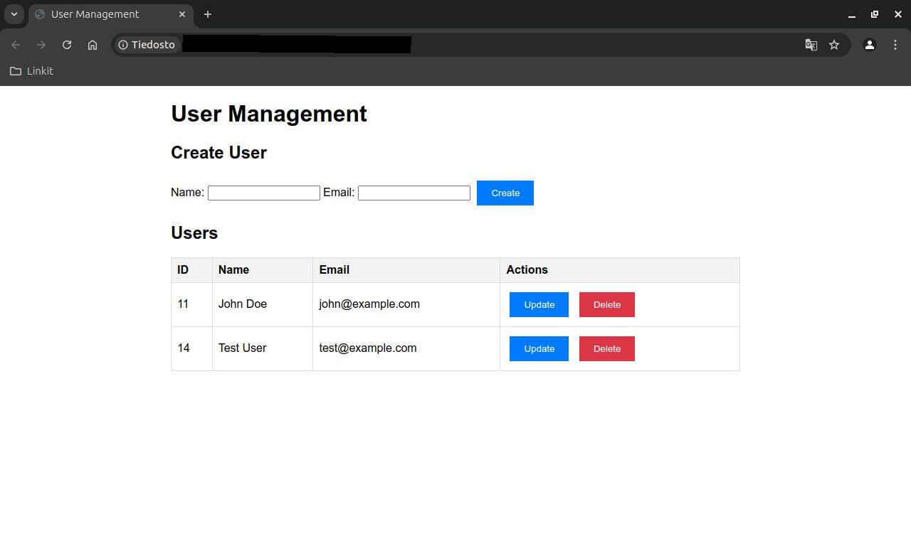

# Go CRUD App with PostgreSQL

TThis is a simple CRUD (Create, Read, Update, Delete) web application built using Go and PostgreSQL. The app uses the Gorilla Mux router for routing and interacts with a PostgreSQL database for data persistence. It also provides a web GUI for managing users.

## Features

- Create new records in the database
- Read and display records
- Update existing records
- Delete records from the database
- Web GUI for user management

## Prerequisites

To run this project, you need the following installed on your system:

- [Go](https://golang.org/dl/) (version 1.23 or newer)
- [PostgreSQL](https://www.postgresql.org/download/)
- [Git](https://git-scm.com/)

## Setup

### 1. Clone the Repository

```bash
git clone https://github.com/your-username/go-crud-app.git
cd go-crud-app
```
### 2. Install Dependencies
This project uses Go modules for dependency management. Install the required packages using:
```bash
go mod tidy
```
### 3. Configure PostgreSQL
Create a PostgreSQL database and user for the application:  
```bash
sudo -u postgres psql
CREATE DATABASE cruddb;
CREATE USER petri WITH PASSWORD 'yourpassword';
GRANT ALL PRIVILEGES ON DATABASE cruddb TO 'user';
```  
Make sure to replace 'yourpassword' with your actual password. The database connection string in the Go app should be updated accordingly.
### 4. Run the Application
To start the server, use:
```bash
go run main.go
```
The application will be running on `localhost:8080`.
# Access the Web GUI
Open your web browser and navigate to `http://localhost:8080`. You will see a simple web interface to manage users with functionalities to create, update, and delete user records.
# API Endpoints
- `GET /users` - Retrieve all users
- `GET /users/{id}` - Retrieve a user by ID
- `POST /users` - Create a new user (requires a JSON payload)
- `PUT /users/{id}` - Update a user by ID (requires a JSON payload)
- `DELETE /users/{id}` - Delete a user by ID
# Example Request Payloads
## Create a New User (POST /users)
```bash
{
    "firstname": "John",
    "lastname": "Doe"
}
```
## Update a User (PUT /users/{id})
```bash
{
    "firstname": "Jane",
    "lastname": "Doe"
}
```
# Environment Variables
The following environment variables can be set for configuring the database connection:
- `DB_USER` - PostgreSQL username (default: `petri`)
- `DB_PASSWORD` - PostgreSQL password
- `DB_NAME` - Name of the PostgreSQL database (default: `cruddb`)
- `DB_HOST` - Host of the PostgreSQL database (default: `localhost`)
- `DB_PORT` - Port of the PostgreSQL database (default: `5432`)
You can set these variables in your .env file or export them in your shell session.
# Screenshots

