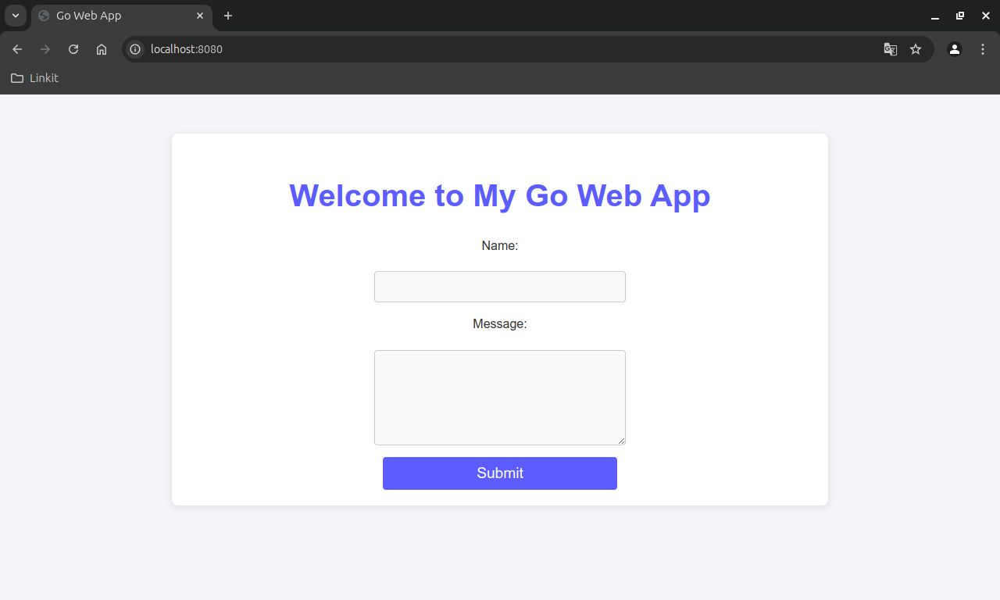

# Simple Go Web Application

This is a basic web application written in Go that demonstrates how to handle HTML form submission and serve static files. The application serves an HTML form where users can submit their name and a message, and then displays the submitted data.

## Features

- Renders an HTML form using Go templates.
- Handles form submission via POST requests.
- Serves static files (e.g., CSS) for styling.
- Built-in simple HTTP server using Go's `net/http` package.

## Project Structure
```sh
.
├── index.html       # HTML file for rendering the form and displaying submitted data
├── main.go          # Main Go application
├── static/          # Directory for static files (e.g., CSS)
├── go.mod           # Go module file for managing dependencies
├── go.sum           # File with checksums of dependencies
└── README.md        # Project documentation
```
## Setup and Installation

1. Clone the repository:
    ```bash
    git clone https://github.com/your-username/simple-go-webapp.git
    cd simple-go-webapp
    ```

2. Make sure you have Go installed. If not, download it from [golang.org](https://golang.org/dl/).

3. Build and run the project:
    ```bash
    go run main.go
    ```

4. Open your browser and visit `http://localhost:8080` to see the form.

## Static Files

To serve static files like CSS, place them in the `static/` directory. The server automatically handles files with the `/static/` route.

## HTML Template

The `index.html` file is used as a template to render both the form and the submitted data. You can modify the template to suit your needs.

Example structure of `index.html`:
```html
<!DOCTYPE html>
<html>
<head>
    <title>Go Web App</title>
    <link rel="stylesheet" type="text/css" href="/static/style.css">
</head>
<body>
    {{if .Name}}
        <h1>Hello, {{.Name}}</h1>
        <p>Your message: {{.Message}}</p>
    {{else}}
        <form action="/" method="POST">
            <label for="name">Name:</label><br>
            <input type="text" id="name" name="name"><br><br>
            <label for="message">Message:</label><br>
            <textarea id="message" name="message"></textarea><br><br>
            <input type="submit" value="Submit">
        </form>
    {{end}}
</body>
</html>
```
# Screenshots
